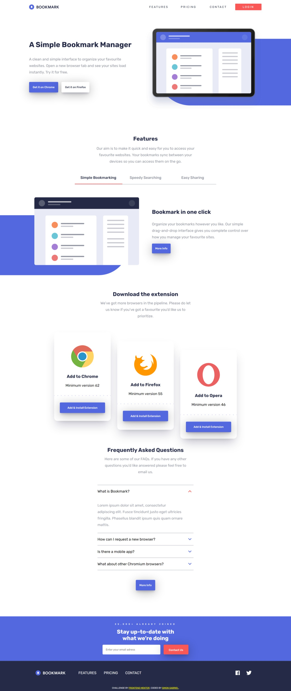

# Frontend Mentor - Bookmark landing page solution

This is a solution to the [Bookmark landing page challenge on Frontend Mentor](https://www.frontendmentor.io/challenges/bookmark-landing-page-5d0b588a9edda32581d29158). Frontend Mentor challenges help you improve your coding skills by building realistic projects. 

## Table of contents

- [Overview](#overview)
  - [The challenge](#the-challenge)
  - [Screenshot](#screenshot)
  - [Links](#links)
- [My process](#my-process)
  - [Built with](#built-with)
  - [What I learned](#what-i-learned)
  - [Continued development](#continued-development)
  - [Useful resources](#useful-resources)
- [Author](#author)
- [Acknowledgments](#acknowledgments)


## Overview

### The challenge

Users should be able to:

- View the optimal layout for the site depending on their device's screen size
- See hover states for all interactive elements on the page
- Receive an error message when the newsletter form is submitted if:
  - The input field is empty
  - The email address is not formatted correctly

### Screenshot



### Links

- Solution URL: [Add solution URL here](https://your-solution-url.com)
- Live Site URL: [Add live site URL here](https://your-live-site-url.com)

## My process

### Built with

- Semantic HTML5 markup
- CSS
- Flexbox
- Javascript
- Mobile-first workflow


### What I learned

This project stretched my knowledge of Vanilla Javascript, I used arrays to render items to the page, I also replaced elements on the page with javascript, for example changing an image using the "src" attribute. I learn't how to add a back-to-top button which I can modify to move to any section of the page. I also learn't how to customize a scroll bar.

```html
  <button id="back-to-top-btn"></button>
```
```css
#back-to-top-btn img {
  transform: rotate(180deg);
}
```
```js
backToTopBtn.addEventListener("click", () => {
  location.href = "#header";
})
```

### Continued development

I want to learn more on how to make scroll behaviour of elements and gain more knowledge on form validation.

### Useful resources

- [Build 15 JavaScript Projects - Vanilla JavaScript Course](https://www.youtube.com/watch?v=3PHXvlpOkf4) - This was the backbone of my entire project, John is a great teacher, he really helped learn how to render items in an array. I really liked this pattern and will use it going forward.
- [Window sizes and scrolling](https://javascript.info/size-and-scroll-window) - This helped me know the various scroll opions available. I'd recommend it to anyone still learning this concept.


## Author

- Website - [Add your name here](https://www.your-site.com)
- Frontend Mentor - [@i-Strider243](https://www.frontendmentor.io/profile/i-Strider243)
- X - [@Strider18](https://x.com/Strider18)
- LinkedIn - [@SimonGabriel](www.linkedin.com/in/simon-gabriel-b71216227)


## Acknowledgments
I acknowledge MDN Docs for their invaluable documentations on web elements.
